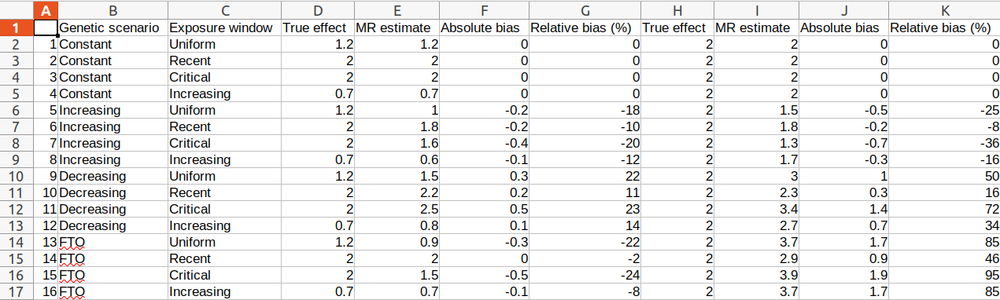

# labrecque_and_swanson_2018

Code of 'Interpretation and Potential Biases of Mendelian Randomization Estimates With Time-Varying Exposures', by Jeremy A Labrecque and Sonja A Swanson

 * [Download the code](correct_code.R)

 * [Download the correct table as a .csv](table_1_correct.csv)

